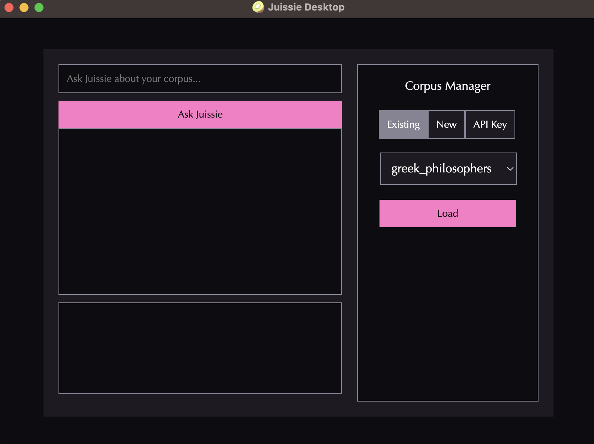

# 🥝 JUISSIE (JUlIa Semantic Search pIpelinE)

Juissie is a Julia-native semantic query engine. It can be used as a package in software development workflows, or via its desktop user interface.

Juissie was developed as a class project for CSCI 6221: Advanced Software Paradigms at The George Washington University.

## Table of Contents
* [Table of Contents](#table-of-contents)
* [Getting Started](#getting-started)
* [Usage](#usage)
* [Contact](#contact)

## Getting Started

Setup guides can be found in the `guides` directory. For quickstart, see `guides/setup.md`.

## Usage

### Desktop UI

Navigate to the root directory of this repository (`Juissie.jl`), enter the following into the command line, and press the enter/return key:

```bash
julia src/Frontend.jl
```

This will launch our application:




### Julia Package

Documentation TODO. Walkthroughs of module basic usage may be found in the `notebooks` directory.


## Contact

Questions? Reach out to our team:
- Lucas H. McCabe ([@lucasmccabe](https://github.com/lucasmccabe), [email](mailto:lucasmccabe@gwu.edu))
- Arthur Bacon ([@toon-leader-bacon](https://github.com/toon-leader-bacon), [email](mailto:ArthurBacon@NocabSoftware.com))
- Alexey Iakovenko ([@AlexeyIakovenko](https://github.com/AlexeyIakovenko), [email](mailto:alexey@iakovenko.com))
- Artin Yousefi ([@ArtinYousefi](https://github.com/ArtinYousefi), [email](mailto:artinyousefi@gwmail.gwu.edu))
